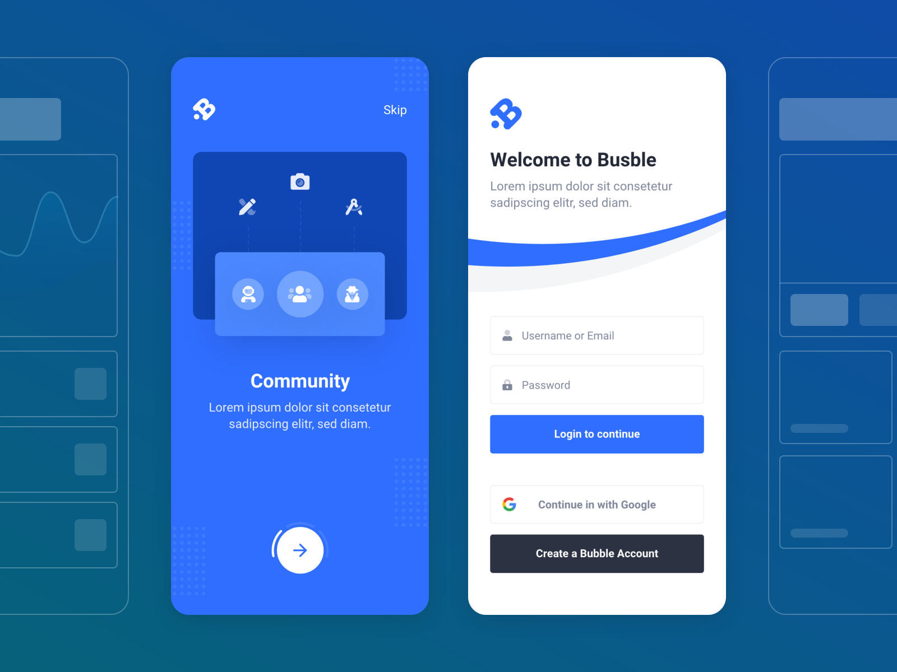
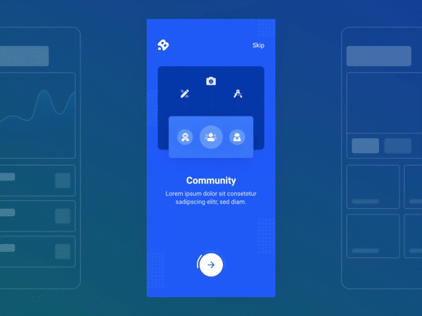

# Onboarding Concept

Design credit: [Yoonuch Chayhet](https://dribbble.com/shots/11018841-Onboarding-concept)

Tutorial credit: [Mangirdas Kazlauskas](https://github.com/MangirdasKazlauskas/flutter-design-challenges) on [Medium](https://uxdesign.cc/flutter-design-challenge-onboarding-concept-1f5774d55646)

    
    

`left` - design implementation without motion design (static design components/content only).

`right` - full implementation of the design concept with animations.

## Getting Started

This project is a starting point for a Flutter application.

A few resources to get you started if this is your first Flutter project:

- [Lab: Write your first Flutter app](https://flutter.dev/docs/get-started/codelab)
- [Cookbook: Useful Flutter samples](https://flutter.dev/docs/cookbook)

For help getting started with Flutter, view our
[online documentation](https://flutter.dev/docs), which offers tutorials,
samples, guidance on mobile development, and a full API reference.
